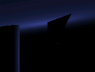

<div align="center">

## Semi\-realtime Raytracer 2: Primitives\!


</div>

### Description

Complete rebuild of my previous port of the C++ raytracer. This supports: Spheres, Triangles, Planes, Cylinders. Also supports shadows(!), reflections(!!), and multiple _colored_ light sources. Hence why it is so slow. You can now turn on/off options, so you can see everything nicely. Note that you MUST compile to get a bit decent framerate. With triangle support, it's in theory possible to load 3D models and raytrace them.

I might optimize the code later (it's become a bit messy), but it really depends on your votes.

Note that the rendered scene might look a bit chaotic. This is more because of the large "gaps" between every frame.

Note that Raytracers are known for their slowness. That's why there aren't (m)any real-time raytraced programs yet.
 
### More Info
 


<span>             |<span>
---                |---
**Submitted On**   |2002-04-01 17:12:44
**By**             |[Almar Joling](https://github.com/Planet-Source-Code/PSCIndex/blob/master/ByAuthor/almar-joling.md)
**Level**          |Intermediate
**User Rating**    |4.6 (46 globes from 10 users)
**Compatibility**  |VB 6\.0
**Category**       |[Graphics](https://github.com/Planet-Source-Code/PSCIndex/blob/master/ByCategory/graphics__1-46.md)
**World**          |[Visual Basic](https://github.com/Planet-Source-Code/PSCIndex/blob/master/ByWorld/visual-basic.md)
**Archive File**   |[Semi\-realt67388412002\.zip](https://github.com/Planet-Source-Code/almar-joling-semi-realtime-raytracer-2-primitives__1-33289/archive/master.zip)

### API Declarations

```
Public Declare Function SetDIBits Lib "gdi32" (ByVal hdc As Long, ByVal hBitmap As Long, ByVal nStartScan As Long, ByVal nNumScans As Long, lpBits As Any, lpBI As BITMAPINFO, ByVal wUsage As Long) As Long
Private Declare Function timeGetTime Lib "winmm.dll" () As Long
Private Declare Function GetTickCount Lib "kernel32" () As Long
```


